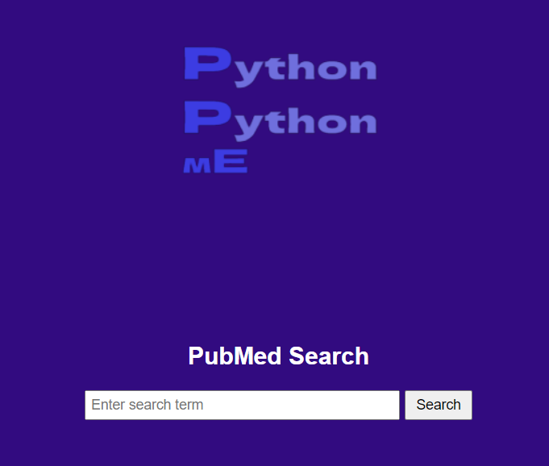
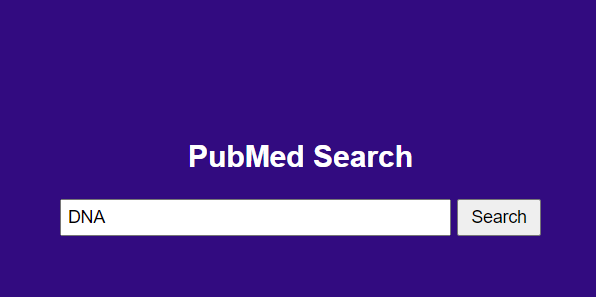
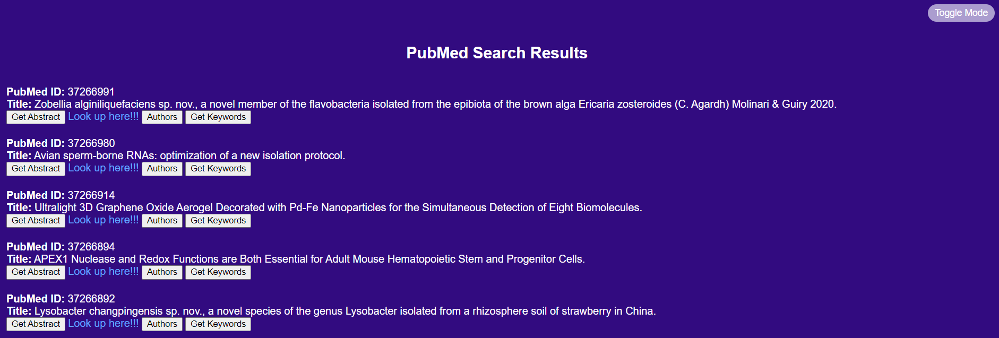
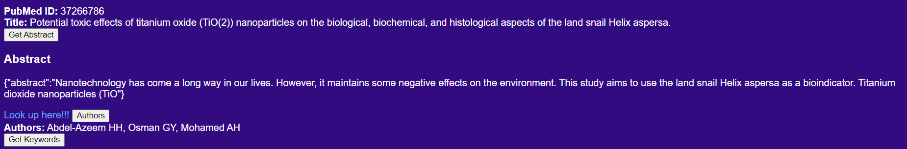
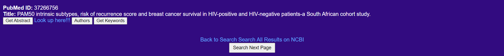

# PubMed Search Application

This is a Flask application that allows you to search for articles on PubMed and retrieve their abstracts and keywords.

## Prerequisites

- Python 3.x
- Flask
- requests
- xml.etree.ElementTree

## Installation

1. Clone the repository:

   ```bash
   git clone <repository-url>

2. Install the dependencies:

    ```bash
    pip install flask requests

## Usage

a. Run the Flask application:
    ```
    python app.py
    ```
 
b. Open your web browser and navigate to http://localhost:5000 to access the application.

c. Enter your search term in the search box and click "Search" to retrieve the results.

d. Click the "Get Abstract" button to fetch the abstract of a specific article.

e. Click the "Get Keywords" button to fetch the keywords associated with a specific article.

## API Endpoints

* GET /search: Searches PubMed articles based on the provided search term and page number.

* GET /abstract/<pubmed_id>: Retrieves the abstract of an article with the given PubMed ID.

* GET /keywords/<pubmed_id>: Retrieves the keywords associated with an article with the given PubMed ID.

# License
This project is licensed under the MIT License.

# Demo
* Main UI with search bar where you can search regularly.



* Searching for ''DNA''



* Corresponding results displayed



* On clicking the buttons Get Abstract and Authors U see the corresponding results.



* Continue with the search for further results

